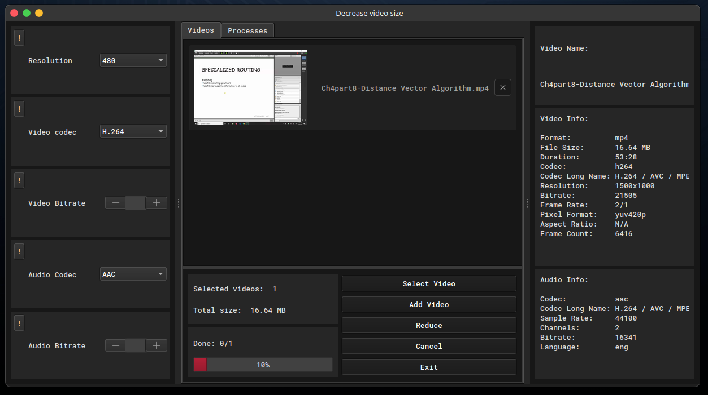

# pitpac

## Overview

Pitpac is a python-based application built with Qt. i built this app for my personal use cases such as creating PDFs from images, combining PDFs, resizing images, extracting text from images and reducing video file sizes.




## Features

- **Create PDFs**: Generate PDFs from images.
- **Combine PDFs**: Merge multiple PDFs into a single file.
- **Image Processing**: Resize images or convert them into icon files.
- **Text Extraction**: Extract text from images using OCR (Optical Character Recognition).
- **Video Compression**: Reduce the size of video files.

## Planned Features

- Video preview to compare original and compressed videos.
- Estimated file size calculation for compressed videos.

## Settings

Customize the following options:

- Enable/disable preview for resized images.
- Set the default directory for file dialogs.
- Adjust font size and font family.

## Installation

### Prerequisites

- Python 3.8 or higher.
- Tesseract OCR (required for text extraction; see Notes below).
- Supported on Windows, macOS, and Linux.

Just run

```
pip install -r requirements.txt
```

And this should install all the necessary packages for you.

## Notes

1. ### Text Extraction:

   Pitpac uses the pytesseract package for OCR, which requires Tesseract to be installed on your system. Installation instructions:

   - Windows: Download and install from Tesseract at UB Mannheim.
   - Linux: Run sudo apt-get install tesseract-ocr.
   - macOS: Run brew install tesseract.

   Note: The OCR feature may not perform as expected in some cases. Future updates will allow integration with external OCR tools.

2. ### Font Errors

   ```
   QFont::fromString: Invalid description 'Fira Sans,10,-1,5,400,0,0,0,0,0,0,0,0,0,0,1'
   QFont::fromString: Invalid description 'FiraCode Nerd Font Mono,10,-1,5,400,0,0,0,0,0,0,0,0,0,0,1'
   QFont::fromString: Invalid description 'Fira Sans,10,-1,5,400,0,0,0,0,0,0,0,0,0,0,1'
   QFont::fromString: Invalid description 'Fira Sans,10,-1,5,400,0,0,0,0,0,0,0,0,0,0,1'
   ```

   That's ok, you can use the app without any issue. That's because in the qt5 app the fonts are not applied correctly, unlike qt6 which this issue is fixed in it.

3. ## Video Compression

   Some videos like with `.mkw` format, the video bitrate and audio bitrate might not be found, so i put an input too enter you own desier bitrate both for video bitrate and audio bitrate.

4. ## Theme
   The application theme is only dark mode for now. Custom theme support is planned for future updates.

If you faced any unexpected issue you can contact me via Telegram: [@MohammadKeshtegar](https://t.me/Mohammadkeshtegar1401).
